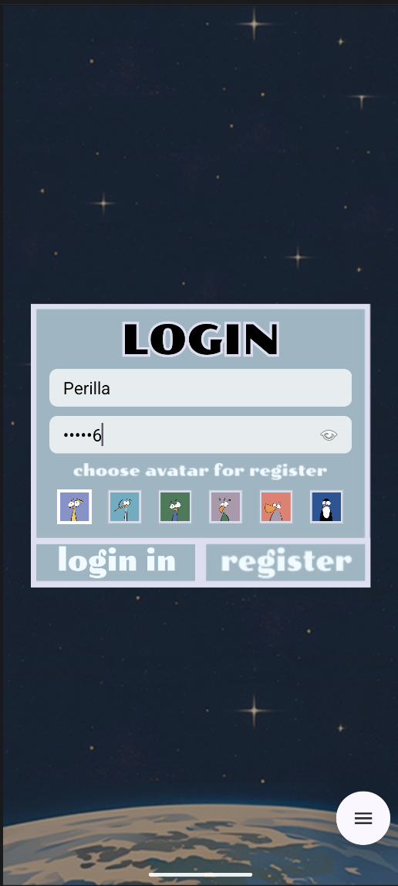
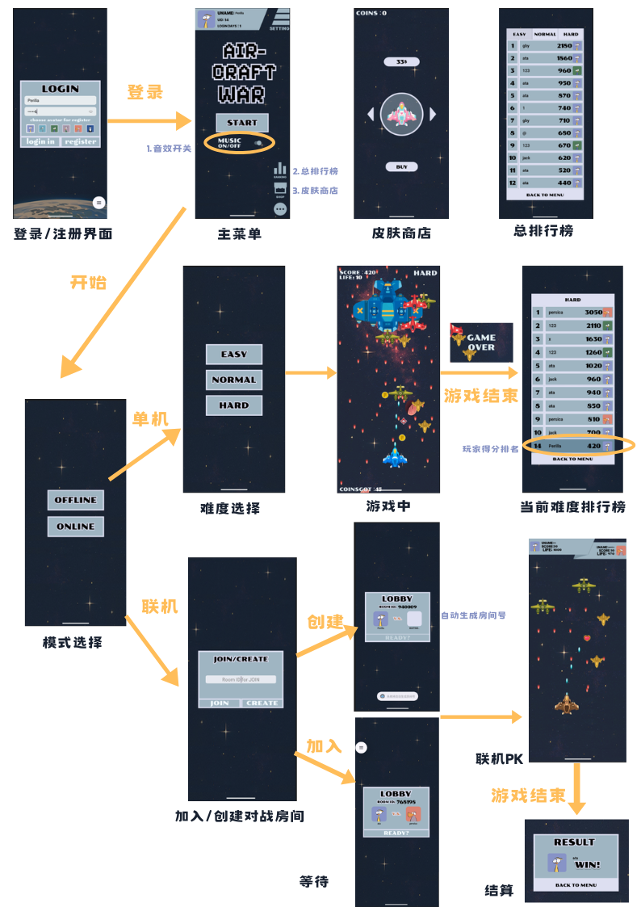
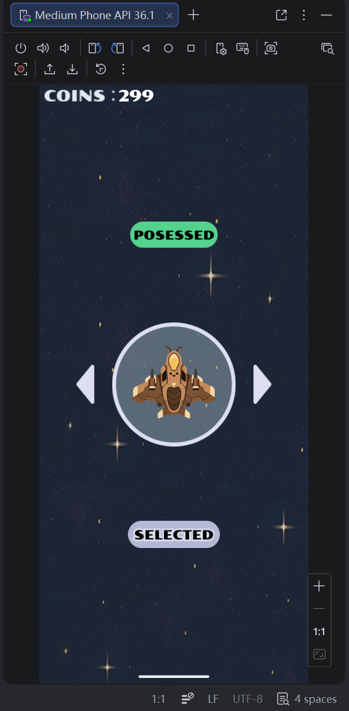
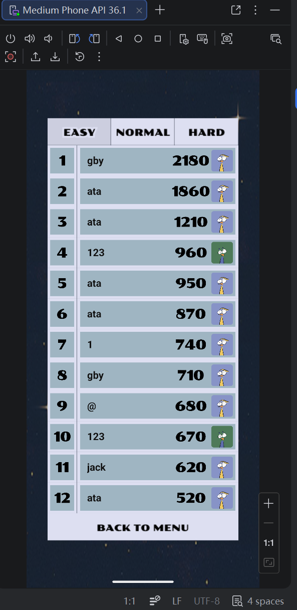
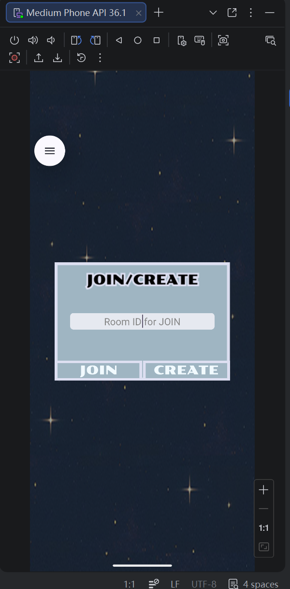
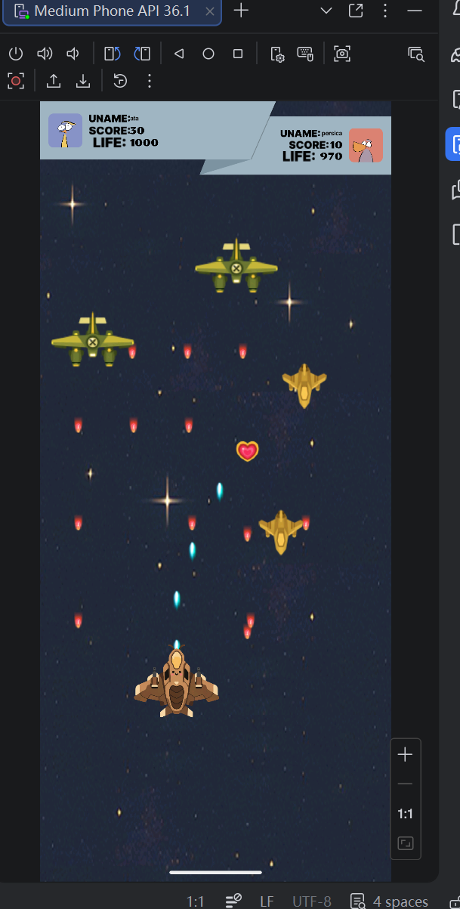
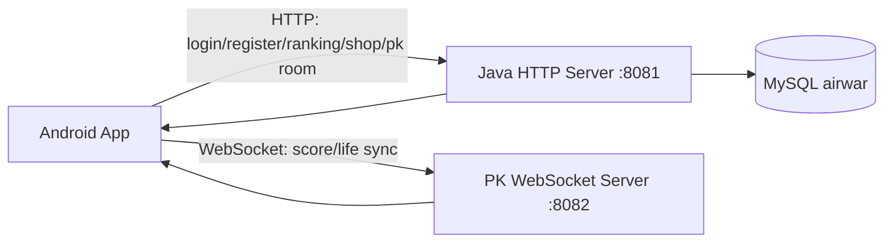
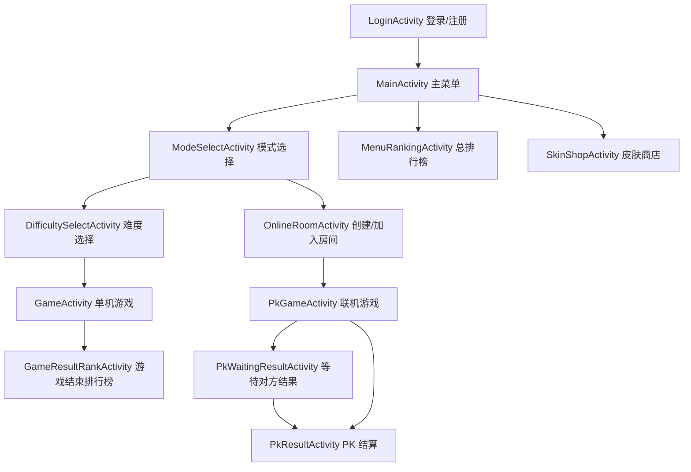

# AirWar Android

> 一个从 PC 端 Java 飞机大战重构而来的 Android 全栈游戏项目。项目保留原有飞机大战的核心玩法，并围绕移动端交互、统一视觉风格、账号系统、云端排行榜、皮肤商店和双人联机 PK 进行了完整工程化改造。

<p>
  
  
  
  
</p>

---

## 1. 项目概览

AirWar Android 是一个前后端分离的移动端空战游戏：

- **Android 客户端**：负责游戏运行、页面展示、触屏操作、音效播放、排行榜展示、皮肤商店和联机 PK 页面。
- **Java 后端服务**：负责账号登录注册、成绩上传、排行榜查询、金币与皮肤同步、PK 房间状态管理和 WebSocket 实时同步。
- **MySQL 数据库**：保存用户、分数、金币、皮肤拥有状态和 PK 房间结果。

项目不是简单把桌面端代码复制到 Android，而是采用“**复用核心游戏模型，重写平台相关能力**”的方式完成迁移：保留飞机、子弹、敌机、道具、策略、工厂等核心逻辑；将原 PC 端的 Swing/JPanel、鼠标监听、文件路径资源加载，替换为 Android 的 `Activity`、`SurfaceView`、`Canvas`、触屏事件、`res/drawable` 资源体系和移动端生命周期管理。

---

## 2. 运行截图

| 登录 / 注册                         | 主流程总览                                      | 皮肤商店                               |
| ------------------------------- | ------------------------------------------ | ---------------------------------- |
|  |  |  |

| 总排行榜                                     | 联机房间                                      | 联机 PK                          |
| ---------------------------------------- | ----------------------------------------- | ------------------------------ |
|  |  |  |

---

## 3. 技术栈

### Android 客户端

- Language：Java
- UI：XML Layout + Activity + 自定义 View
- Game Render：`SurfaceView` + `Canvas` + 独立渲染线程
- Network：OkHttp HTTP 请求 + OkHttp WebSocket 客户端
- Storage：`SharedPreferences`
- Audio：`MediaPlayer` + `SoundPool`
- Build：Gradle / Android Gradle Plugin

### 后端服务

- Language：Java 11
- HTTP：JDK `HttpServer`
- WebSocket：`org.java-websocket:Java-WebSocket`
- JSON：`org.json`
- Database：MySQL 8.0 + JDBC
- Build：Gradle Kotlin DSL

---

## 4. 仓库结构

推荐将仓库整理为下面的结构：

```text
AirWar-Android/
├── README.md
├── docs/
│   ├── images/
│   └── schema.sql
├── frontend/                         # Android 客户端工程
│   ├── app/
│   │   ├── src/main/AndroidManifest.xml
│   │   ├── src/main/java/edu/hitsz/
│   │   └── src/main/res/
│   ├── build.gradle
│   └── settings.gradle
└── backend/                          # Java 后端工程
    ├── MyServer/
    │   ├── build.gradle.kts
    │   └── src/main/java/com/example/myserver/
    ├── build.gradle.kts
    └── settings.gradle.kts
```

---

## 5. 系统设计思路

### 5.1 从 PC 端游戏到 Android 游戏

原 PC 端项目的价值主要在游戏规则和对象模型，例如：

- `aircraft/`：英雄机、普通敌机、精英敌机、Boss 敌机
- `bullet/`：英雄机子弹、敌机子弹
- `prop/`：回血、炸弹、火力、金币等道具
- `factory/`：敌机和道具创建逻辑
- `strategy/`：直射、散射、环形射击等策略

迁移时保留这些核心逻辑，同时把强依赖桌面端的部分重写：

| PC 端能力          | Android 端替代实现                    | 关键文件                                                           |
| --------------- | -------------------------------- | -------------------------------------------------------------- |
| `Main` 桌面入口     | 多 Activity 页面流                   | `LoginActivity.java`, `MainActivity.java`, `GameActivity.java` |
| Swing/JPanel 绘制 | `SurfaceView` + `Canvas`         | `application/Game.java`                                        |
| 鼠标拖拽控制          | 触屏 `OnTouchListener`             | `application/HeroController.java`                              |
| 本地文件图片加载        | `res/drawable` + `BitmapFactory` | `manager/ImageManager.java`                                    |
| 桌面音乐线程          | `MediaPlayer` + `SoundPool`      | `manager/SoundManager.java`, `manager/MenuBgmManager.java`     |
| 本地排行榜           | HTTP + MySQL 云端排行榜               | `GameResultRankActivity.java`, `ScoreUploadResultHandler.java` |

### 5.2 前后端架构



HTTP 适合处理登录、注册、排行榜、商店、创建房间、加入房间、准备、提交结果等状态型请求；WebSocket 适合处理联机对战中的实时分数和生命值同步。

### 5.3 客户端页面流程



---

## 6. 具体实现

### 6.1 游戏核心与 Android 迁移

游戏运行的核心承载类是 `frontend/app/src/main/java/edu/hitsz/application/Game.java`。它继承 `SurfaceView`，实现 `SurfaceHolder.Callback` 和 `Runnable`，在独立线程中完成游戏逻辑更新和画面绘制。

关键实现点：

- `GameActivity.java` 根据 `difficulty` 参数创建 `EasyGame`、`NormalGame` 或 `HardGame`。
- `Game.java` 负责敌机生成、子弹移动、碰撞检测、道具生效、Boss 切换、金币统计和 Game Over 回调。
- `HeroController.java` 将 Android 触屏事件转换为英雄机坐标更新。
- `ImageManager.java` 统一加载和缩放英雄机、敌机、子弹、道具和皮肤图片。
- `EasyGame.java`、`NormalGame.java`、`HardGame.java` 通过模板方法配置不同难度下的敌机数量、Boss 血量、刷新周期和难度增长策略。

核心文件：

```text
frontend/app/src/main/java/edu/hitsz/activity/GameActivity.java
frontend/app/src/main/java/edu/hitsz/application/Game.java
frontend/app/src/main/java/edu/hitsz/application/EasyGame.java
frontend/app/src/main/java/edu/hitsz/application/NormalGame.java
frontend/app/src/main/java/edu/hitsz/application/HardGame.java
frontend/app/src/main/java/edu/hitsz/application/HeroController.java
frontend/app/src/main/java/edu/hitsz/manager/ImageManager.java
frontend/app/src/main/java/edu/hitsz/config/GameConfig.java
```

### 6.2 移动端 UI 重构

项目没有沿用系统默认控件风格，而是使用星空背景、PNG 按钮、PNG 标签、PNG 数字和圆角头像组件重构了整体视觉。

关键实现点：

- `FlowBackgroundView.java` 绘制循环滚动星空背景。
- `BackgroundScrollManager.java` 统一管理背景滚动状态，避免页面切换后背景突兀重置。
- `DigitTextView.java` 将数字拆分为 PNG 图片显示，保证游戏 UI 字体风格统一。
- `RoundCornerImageView.java` 负责头像圆角显示。
- `PressEffectUtil.java` 和 `GrayPressEffectUtil.java` 为图片按钮提供按压反馈。
- 各 Activity 根据屏幕尺寸动态计算弹窗、头像、排行榜、PK 顶部栏等区域大小，减少不同机型上的拉伸和裁切问题。

核心文件：

```text
frontend/app/src/main/java/edu/hitsz/widget/FlowBackgroundView.java
frontend/app/src/main/java/edu/hitsz/manager/BackgroundScrollManager.java
frontend/app/src/main/java/edu/hitsz/widget/DigitTextView.java
frontend/app/src/main/java/edu/hitsz/widget/RoundCornerImageView.java
frontend/app/src/main/java/edu/hitsz/util/PressEffectUtil.java
frontend/app/src/main/java/edu/hitsz/util/GrayPressEffectUtil.java
frontend/app/src/main/res/layout/activity_main_menu.xml
frontend/app/src/main/res/layout/activity_login.xml
frontend/app/src/main/res/layout/activity_skin_shop.xml
frontend/app/src/main/res/layout/activity_pk_game.xml
```

### 6.3 音乐与音效系统

音频分为长音频和短音效两类：

- 长音频：菜单 BGM、游戏 BGM、Boss BGM，使用 `MediaPlayer`。
- 短音效：击中、炸弹、道具、游戏结束，使用 `SoundPool`。

音效开关状态通过 `SharedPreferences` 保存，页面切换后仍保持一致。游戏页在 `onPause()`、`onResume()`、`onDestroy()` 中控制音频暂停、恢复和释放，避免多个页面的音乐重叠。

核心文件：

```text
frontend/app/src/main/java/edu/hitsz/manager/SoundManager.java
frontend/app/src/main/java/edu/hitsz/manager/MenuBgmManager.java
frontend/app/src/main/java/edu/hitsz/manager/SoundSettingManager.java
frontend/app/src/main/res/raw/bgm.ogg
frontend/app/src/main/res/raw/bgm_boss.ogg
frontend/app/src/main/res/raw/bomb_explosion.wav
frontend/app/src/main/res/raw/bullet_hit.wav
```

### 6.4 账号登录与注册

账号系统通过 Android 前端 OkHttp 请求后端 HTTP 接口实现。登录成功后，客户端使用 `UserSession` 保存运行期用户信息，使用 `SessionManager` 将用户 ID、用户名、头像、登录天数持久化到本地。

核心文件：

```text
frontend/app/src/main/java/edu/hitsz/activity/LoginActivity.java
frontend/app/src/main/java/edu/hitsz/application/UserSession.java
frontend/app/src/main/java/edu/hitsz/manager/SessionManager.java
frontend/app/src/main/java/edu/hitsz/config/ApiConfig.java
backend/MyServer/src/main/java/com/example/myserver/LoginServer.java
backend/MyServer/src/main/java/com/example/myserver/LoginHandler.java
backend/MyServer/src/main/java/com/example/myserver/RegisterHandler.java
backend/MyServer/src/main/java/com/example/myserver/DbUtil.java
```

接口：

| 功能  | Method | Path                                               |
| --- | ------ | -------------------------------------------------- |
| 登录  | GET    | `/login?username=...&password=...`                 |
| 注册  | GET    | `/register?username=...&password=...&avatarId=...` |

### 6.5 排行榜系统

排行榜分为主菜单排行榜和游戏结束结算排行榜：

- `MenuRankingActivity.java`：从主菜单进入，可切换 Easy / Normal / Hard 三种难度。
- `GameResultRankActivity.java`：游戏结束后上传本局分数与金币，并展示当前难度排行榜。
- `RankingMenuHandler.java`：查询不同难度排行榜。
- `ScoreUploadResultHandler.java`：写入本局成绩、同步金币、返回结算排名。

核心文件：

```text
frontend/app/src/main/java/edu/hitsz/activity/MenuRankingActivity.java
frontend/app/src/main/java/edu/hitsz/activity/GameResultRankActivity.java
frontend/app/src/main/java/edu/hitsz/application/RankRecord.java
backend/MyServer/src/main/java/com/example/myserver/RankingMenuHandler.java
backend/MyServer/src/main/java/com/example/myserver/ScoreUploadResultHandler.java
```

接口：

| 功能       | Method | Path                                                                                             |
| -------- | ------ | ------------------------------------------------------------------------------------------------ |
| 总排行榜     | GET    | `/ranking/menu?difficulty=EASY&limit=12`                                                         |
| 上传并获取结算榜 | GET    | `/score/uploadResult?userId=...&username=...&avatarId=...&difficulty=...&score=...&coinsGot=...` |

### 6.6 皮肤商店与金币系统

玩家在单机游戏中获得金币，游戏结束后金币通过成绩上传接口同步到用户账号。商店中可以浏览皮肤、购买皮肤、选择当前皮肤，选中的皮肤会在下一局游戏中替换英雄机图片。

核心文件：

```text
frontend/app/src/main/java/edu/hitsz/activity/SkinShopActivity.java
frontend/app/src/main/java/edu/hitsz/config/SkinConfig.java
frontend/app/src/main/java/edu/hitsz/manager/ShopStateManager.java
frontend/app/src/main/java/edu/hitsz/prop/PropCoin.java
backend/MyServer/src/main/java/com/example/myserver/ShopStatusHandler.java
backend/MyServer/src/main/java/com/example/myserver/ShopBuyHandler.java
backend/MyServer/src/main/java/com/example/myserver/ShopSelectHandler.java
```

接口：

| 功能   | Method | Path                                        |
| ---- | ------ | ------------------------------------------- |
| 商店状态 | GET    | `/shop/status?userId=...`                   |
| 购买皮肤 | GET    | `/shop/buy?userId=...&skinId=...&price=...` |
| 选择皮肤 | GET    | `/shop/select?userId=...&skinId=...`        |

### 6.7 双人联机 PK

联机功能采用“HTTP 管房间 + WebSocket 同步状态”的设计。

流程：

1. 玩家在 `ModeSelectActivity.java` 选择 ONLINE。
2. `OnlineRoomActivity.java` 创建房间或输入房间号加入。
3. 后端 `PkCreateRoomHandler.java` / `PkJoinRoomHandler.java` 写入 `pk_room`。
4. 双方点击 READY，`PkReadyHandler.java` 将房间状态更新为 `PLAYING`。
5. `PkGameActivity.java` 启动本地游戏，同时通过 `PkWebSocketClient.java` 周期性发送自己的分数和生命值。
6. 后端 `PkWebSocketServer.java` 将状态转发给同房间对手。
7. 游戏结束后，`PkFinishHandler.java` 记录双方最终分数并计算胜者。

核心文件：

```text
frontend/app/src/main/java/edu/hitsz/activity/OnlineRoomActivity.java
frontend/app/src/main/java/edu/hitsz/activity/PkGameActivity.java
frontend/app/src/main/java/edu/hitsz/activity/PkWaitingResultActivity.java
frontend/app/src/main/java/edu/hitsz/activity/PkResultActivity.java
frontend/app/src/main/java/edu/hitsz/application/PkApiClient.java
frontend/app/src/main/java/edu/hitsz/application/PkWebSocketClient.java
frontend/app/src/main/java/edu/hitsz/config/ServerConfig.java
backend/MyServer/src/main/java/com/example/myserver/PkCreateRoomHandler.java
backend/MyServer/src/main/java/com/example/myserver/PkJoinRoomHandler.java
backend/MyServer/src/main/java/com/example/myserver/PkReadyHandler.java
backend/MyServer/src/main/java/com/example/myserver/PkRoomStatusHandler.java
backend/MyServer/src/main/java/com/example/myserver/PkFinishHandler.java
backend/MyServer/src/main/java/com/example/myserver/PkWebSocketServer.java
backend/MyServer/src/main/java/com/example/myserver/PkRoomCleanupUtil.java
```

接口：

| 功能   | Method    | Path                                                             |
| ---- | --------- | ---------------------------------------------------------------- |
| 创建房间 | GET       | `/pk/createRoom?userId=...&username=...&avatarId=...`            |
| 加入房间 | GET       | `/pk/joinRoom?roomCode=...&userId=...&username=...&avatarId=...` |
| 查询房间 | GET       | `/pk/roomStatus?roomId=...`                                      |
| 准备   | GET       | `/pk/ready?roomId=...&userId=...`                                |
| 提交结果 | GET       | `/pk/finish?roomId=...&userId=...&score=...`                     |
| 实时同步 | WebSocket | `/pk/ws?roomId=...&userId=...`                                   |

---

## 7. 解决的关键问题

### 7.1 桌面端代码迁移到移动端

原项目依赖 Swing 窗口、鼠标监听和桌面端资源路径，无法直接运行在 Android。项目通过 `GameActivity.java` + `Game.java` + `HeroController.java` 重构入口、绘制方式和交互方式，使核心玩法在移动端可运行。

### 7.2 不同机型 UI 适配

早期固定尺寸布局在不同分辨率模拟器上会出现错位、拉伸或裁切。项目在 `MainActivity.java`、`LoginActivity.java`、`MenuRankingActivity.java`、`PkGameActivity.java` 等文件中根据容器宽高动态计算组件尺寸，并对 PNG 素材采用等比例缩放。

### 7.3 页面切换时背景状态不连续

多个页面都使用星空背景，如果每个页面单独从 0 开始滚动，视觉上会突兀。项目将滚动状态抽到 `BackgroundScrollManager.java`，由 `FlowBackgroundView.java` 在各页面复用同一个滚动状态。

### 7.4 音频重叠与生命周期管理

Android 页面切换频繁，如果不处理生命周期，容易出现菜单音乐和游戏音乐重叠。项目将菜单音乐和战斗音频拆分到 `MenuBgmManager.java`、`SoundManager.java`，并在 Activity 生命周期中暂停、恢复和释放资源。

### 7.5 联机结算并发问题

PK 双方可能几乎同时提交游戏结果。`PkFinishHandler.java` 使用事务和 `SELECT ... FOR UPDATE` 锁定房间记录，保证同一房间结果不会被重复覆盖；双方都结束后再计算胜者并进入结算页。

### 7.6 碰撞检测性能优化

原英雄子弹与敌机碰撞检测是全量双重循环，后期对象变多时计算压力较大。`Game.java` 中引入空间网格思路，通过 `GRID_SIZE`、`enemyGrid`、`buildEnemyGrid()` 等方法让子弹只检测附近网格的敌机，减少无效碰撞判断。同时对象集合改为更适合顺序遍历的 `ArrayList`。

### 7.7 数据库无效房间堆积

联机测试会产生大量过期房间。`PkRoomCleanupUtil.java` 在创建房间时清理超时的 WAITING / READY / PLAYING / FINISHED 房间，减少数据库长期堆积。

---

## 8. 本地复刻与运行

### 8.1 环境要求

- Android Studio：支持 Android Studio Panda 2 | 2025.3.2 的版本
- JDK：11
- MySQL：8.0
- Android SDK：项目当前 `minSdk 30`，`targetSdk 36`
- 端口：HTTP `8081`，WebSocket `8082`

### 8.2 初始化数据库

进入 MySQL 后执行：

```bash
mysql -u root -p < docs/schema.sql
```

如果你不使用 root 用户，请先创建专用用户：

```sql
CREATE USER 'airwar_user'@'%' IDENTIFIED BY 'your_password';
GRANT ALL PRIVILEGES ON airwar.* TO 'airwar_user'@'%';
FLUSH PRIVILEGES;
```

### 8.3 启动后端服务

Linux / macOS：

```bash
cd backend
./gradlew :MyServer:jar

export DB_URL="jdbc:mysql://127.0.0.1:3306/airwar?useUnicode=true&characterEncoding=utf8&serverTimezone=Asia/Shanghai&useSSL=false&allowPublicKeyRetrieval=true"
export DB_USER="airwar_user"
export DB_PASSWORD="your_password"

java -jar MyServer/build/libs/airwar-server.jar
```

Windows PowerShell：

```powershell
cd backend
.\gradlew.bat :MyServer:jar

$env:DB_URL="jdbc:mysql://127.0.0.1:3306/airwar?useUnicode=true&characterEncoding=utf8&serverTimezone=Asia/Shanghai&useSSL=false&allowPublicKeyRetrieval=true"
$env:DB_USER="airwar_user"
$env:DB_PASSWORD="your_password"

java -jar .\MyServer\build\libs\airwar-server.jar
```

启动成功后应看到类似输出：

```text
AircraftWar HTTP server started successfully on port 8081
AircraftWar WebSocket server started successfully on port 8082
```

### 8.4 配置 Android 客户端服务器地址

如果后端运行在本机，Android 模拟器访问宿主机需要使用电脑局域网 IP：

```java
// frontend/app/src/main/java/edu/hitsz/config/ApiConfig.java
public static final String BASE_URL = "http://10.0.2.2:8081";

// frontend/app/src/main/java/edu/hitsz/config/ServerConfig.java
public static final String HTTP_BASE_URL = "http://10.0.2.2:8081";
public static final String WS_BASE_URL = "ws://10.0.2.2:8082/pk/ws";
```

如果使用真机测试，请把地址`10.0.2.2`改成电脑局域网 IP 或云服务器公网 IP，并确保防火墙放行 8081 / 8082。

### 8.5 运行 Android 客户端

1. 用 Android Studio 打开 `frontend/`。
2. 等待 Gradle Sync 完成。
3. 启动一个 Android 模拟器。
4. 点击 Run，进入登录页。
5. 注册账号后进入主菜单。
6. 单机流程：`START -> OFFLINE -> EASY/NORMAL/HARD -> 游戏 -> 结算排行榜`。
7. 联机流程：启动两个模拟器或两台设备，分别登录不同账号，进入 `ONLINE`，一个创建房间，一个输入房间号加入，双方 READY 后进入 PK。

### 8.6 云服务器部署建议

1. 将后端打包后的 `airwar-server.jar` 上传到服务器，例如 `/www/airwar-server/`。
2. 配置环境变量 `DB_URL`、`DB_USER`、`DB_PASSWORD`。
3. 开放服务器安全组和防火墙端口：`8081`、`8082`。
4. 使用后台方式启动：

```bash
nohup java -jar airwar-server.jar > server.log 2>&1 &
```

5. 修改 Android 客户端 `ApiConfig.java` 与 `ServerConfig.java` 为公网地址。

---

## 9. 注意事项

- `local.properties`、`.idea/`、`build/`、`.gradle/` 不建议提交到 GitHub。
- 不要把真实数据库密码、服务器密码、云服务器密钥写入仓库；后端已经支持通过 `DB_URL` / `DB_USER` / `DB_PASSWORD` 环境变量覆盖数据库配置。
- 如果仓库历史里已经提交过密码，建议更换密码并清理 Git 历史。
- 当前登录示例以明文密码校验为主，作为公开项目展示时建议改成 BCrypt / PBKDF2 等哈希存储方式。
- 当前 HTTP 接口以 GET 参数传输为主，后续可改为 POST + JSON Body，便于扩展和安全控制。

---

## 10. 后续优化方向

- 登录密码改为哈希存储，并增加 Token 会话机制。
- WebSocket 增加心跳检测、断线重连和异常退出恢复。
- PK 对战加入更严格的服务端校验，减少客户端伪造分数风险。
- 排行榜和房间清理改为定时任务或独立维护脚本。
- 商店增加购买确认、皮肤详情和云端状态冲突处理。
- UI 适配继续覆盖更多真机屏幕比例。

---

## 11. 项目亮点

- 从 PC Java 游戏到 Android 的完整迁移：保留核心游戏逻辑，重构移动端入口、绘制、输入和资源系统。
- 统一游戏风格 UI：星空滚动背景、PNG 标签、PNG 数字、图片按钮、圆角头像、适配不同分辨率。
- 完整账号与云端数据体系：登录注册、排行榜、金币、皮肤、联机房间均接入后端和 MySQL。
- 双人联机 PK：HTTP 管理房间状态，WebSocket 实时同步双方分数与生命值。
- 工程化问题处理：音频生命周期、页面状态衔接、碰撞检测优化、房间清理、并发结算保护等。
